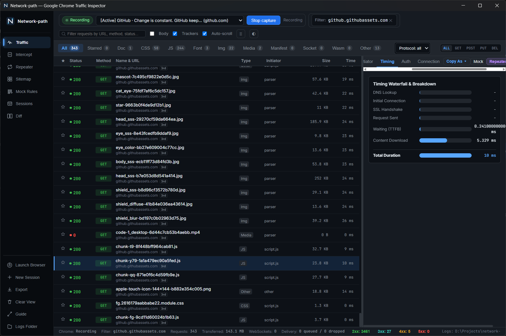
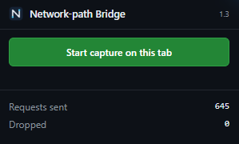

<p align="center"></p>
<h1 align="center">Network-path</h1>
<p align="center"><strong>One path. Two endpoints.</strong></p>
<p align="center">Capture browser traffic. Inspect APIs. Turn requests into code.</p>
<p align="center">
  <a href="https://github.com/Ksirailway-base/network-path/releases/tag/v0.1.0"></a>
  <a href="LICENSE"></a>
</p>
<p align="center">
  <a href="https://github.com/Ksirailway-base/network-path/releases/download/v0.1.0/network-path_0.1.0_x64-setup.exe"><strong>Download for Windows</strong></a> ·
  <a href="#install">All downloads</a> · <a href="#your-first-capture">First capture</a> · <a href="#build-from-source">Build from source</a>
</p>

Network-path is a desktop workspace for inspecting HTTP, HTTPS, and WebSocket traffic from Chromium browsers. Find the API behind a page, inspect its responses, replay a request, and export your work. Capture uses the Chrome DevTools Protocol; no proxy configuration or custom CA certificate is needed.



*Inspect captured requests and their timing in one workspace.*

## What you can do

| Task | Tools |
| --- | --- |
| Understand an API | Request and response bodies, headers, timing, initiators, GraphQL operation names, and WebSocket frames |
| Find useful requests | URL and text filters, body search, resource types, bookmarks, and tracker filtering |
| Reproduce a request | Edit and resend with Repeater; copy as cURL, Python, or JavaScript |
| Explore endpoints | Sitemap groups hosts and dynamic URL paths; compare endpoints between sessions |
| Keep and share a capture | Saved sessions, HAR import/export, Postman, OpenAPI, JSON, and CSV exports |
| Prototype automation | Generate a Python scraper scaffold from captured requests |
| Test different responses | Experimental request interception and mock response rules |

## Install

### Windows

**Requirements:** Windows 10/11 x64, a Chromium browser such as Chrome or Edge, and the [Microsoft WebView2 Runtime](https://developer.microsoft.com/en-us/microsoft-edge/webview2/). Node.js, Rust, and Python are not needed to run the installed app.

1. Download the **[Windows installer (.exe)](https://github.com/Ksirailway-base/network-path/releases/download/v0.1.0/network-path_0.1.0_x64-setup.exe)** and complete setup. An [MSI installer](https://github.com/Ksirailway-base/network-path/releases/download/v0.1.0/network-path_0.1.0_x64_en-US.msi) is also available.
2. Open **Network-path** from the Start menu.
3. Install the browser extension below, then make your first capture.

### Browser extension

1. Download [network-path-extension-1.3.0.zip](https://github.com/Ksirailway-base/network-path/releases/download/v0.1.0/network-path-extension-1.3.0.zip) and extract it into a folder you will keep.
2. In Chrome, open `chrome://extensions`; in Edge, open `edge://extensions`.
3. Enable **Developer mode**, choose **Load unpacked**, and select the extracted folder containing `manifest.json`.
4. Keep Network-path running. The app should show **Extension ready** when the bridge connects.

<p></p>

When running from source, load this repository's `extension/` folder instead. Capture requires a Chromium browser; Firefox and Safari are not supported.

### macOS and other downloads

| Platform | Package | Status |
| --- | --- | --- |
| Windows x64 | [EXE](https://github.com/Ksirailway-base/network-path/releases/download/v0.1.0/network-path_0.1.0_x64-setup.exe) / [MSI](https://github.com/Ksirailway-base/network-path/releases/download/v0.1.0/network-path_0.1.0_x64_en-US.msi) | Tested capture workflow |
| macOS Apple Silicon | [DMG](https://github.com/Ksirailway-base/network-path/releases/download/v0.1.0/network-path_0.1.0_aarch64.dmg) | Experimental |
| macOS Intel | [DMG](https://github.com/Ksirailway-base/network-path/releases/download/v0.1.0/network-path_0.1.0_x64.dmg) | Experimental |

On macOS, open the DMG and drag the app into Applications. The macOS packages are built in GitHub Actions but have not been validated end to end on a Mac. Browser auto-discovery and opening the logs folder still contain Windows-specific behavior; launch your browser manually and load the extension. Linux installers are not included in this release.

Version 0.1.0 is a preview. Packages are unsigned, and macOS packages are not notarized, so the OS may warn or block opening them. See the [release notes and SHA-256 checksums](https://github.com/Ksirailway-base/network-path/releases/tag/v0.1.0) before installing.

## Your first capture

1. Open a regular HTTP(S) page in your browser, such as a public GitHub repository.
2. In Network-path, select that page from the tab dropdown and press **Start capture**.
3. Wait for **Recording**, then reload the page or perform the action you want to inspect.
4. Select a request. Use **Headers**, **Preview**, **Response**, and **Timing** to inspect it.
5. Stop capture when finished. Use **Copy As** for a code snippet, **Repeater** to edit and resend, or **Export** to save a portable capture.

Capture follows the active HTTP(S) tab, including its third-party requests. **New Session** starts a separate capture; **Clear View** only clears the table and keeps saved files. Open previous captures in **Sessions**.

### If no requests appear

- Keep the desktop app open and check that the extension is enabled in the browser profile you are using.
- Select an HTTP(S) tab, wait for **Recording**, and reload it. Browser settings pages cannot be captured.
- Display filters only hide rows; they do not select the capture target. Clear filters when troubleshooting.
- The extension connects to the local app on `127.0.0.1:8765`. Run one instance of the app at a time.

**Capture without extension** is an experimental alternative that launches a separate browser profile. It does not yet provide all extension features.

## Python exports and requirements

The desktop app is built with Rust, Tauri, and JavaScript. Its dependencies are declared in `src-tauri/Cargo.toml` and `package.json`.

[requirements.txt](requirements.txt) is for **Export → scraper.py skeleton**, which uses Python's `requests` package. With Python installed, run this from a clone of the repository:

```sh
python -m pip install -r requirements.txt
```

If you downloaded only the app, use `python -m pip install requests`. Review and adapt the generated scaffold before running it: authentication, pagination, and response parsing depend on the API. Python snippets using `curl_cffi` need that package separately.

## Build from source

Install Git, Node.js 22 or newer, Rust stable, and the [Tauri prerequisites for your operating system](https://v2.tauri.app/start/prerequisites/). On Windows, these include the MSVC C++ build tools, Windows SDK, and WebView2. On macOS, install Xcode Command Line Tools.

```sh
git clone https://github.com/Ksirailway-base/network-path.git
cd network-path
npm ci
npm start
```

`npm start` runs a development build. To create a release package on Windows:

```sh
npm run build -- --bundles nsis,msi
```

On macOS:

```sh
npm run build -- --bundles app,dmg
```

Packages are written under `src-tauri/target/release/bundle/`. The repository's **macOS builds** workflow also builds Apple Silicon and Intel packages in GitHub Actions.

## Preview notes

- Repeater uses its own HTTP client; it does not automatically reuse browser cookies or the browser's TLS session. Response bodies are limited to 5 MiB.
- Intercept, mocks, capture recovery, and delivery/error reporting are still being hardened. WebSocket frames are read-only.
- The local bridge is not hardened for untrusted environments. Captures can contain credentials and personal data; inspect exports before sharing them. Media previews may contact the original URL when no saved body is available.

## License

[MIT](LICENSE) © 2026 [Ksirailway-base](https://github.com/Ksirailway-base).
